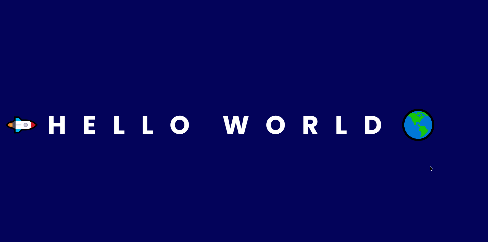

# **Hello World!**

## :earth_americas: **Projeto**
Este projeto faz parte o desafio ***21 Dias de Código*** e se baseia em uma versão criativa do *Hello World!*, na qual abordei a temática espacial e uma brincadeira com emojis.

## :link: **Link**
*[Link do projeto.](https://davsilvam.github.io/21diasdecodigo/02/)*

## :art: **Visual do Projeto**
### *Desktop e Telas Maiores*

<h1 align="center">
    
</h1>

## :rocket: **Funcionalidades do Projeto**
O projeto conta atualmente com:
* Função de avançar para direita ao clicar na *seta para direita*;
* Função de recuar para a esquerda ao clicar na *seta para esquerda*;
* Mensagens ao chegar no destino (:earth_americas:) e ao se afastar.

## :construction: **Futuras atualizações**
Funcionalidades que poderão ser incluídas em breve no projeto:
* Implementar responsividade e deixar o programa mais performático.

## :wrench: **Tecnologias**
Tecnologias utilizadas no projeto.
* HTML;
* CSS;
* JavaScript;
* Visual Studio Code;
* Google Fonts.

## :computer: **Autor**
Feito com :purple_heart: por [David Silva](https://www.linkedin.com/in/davsilvam/).

---
