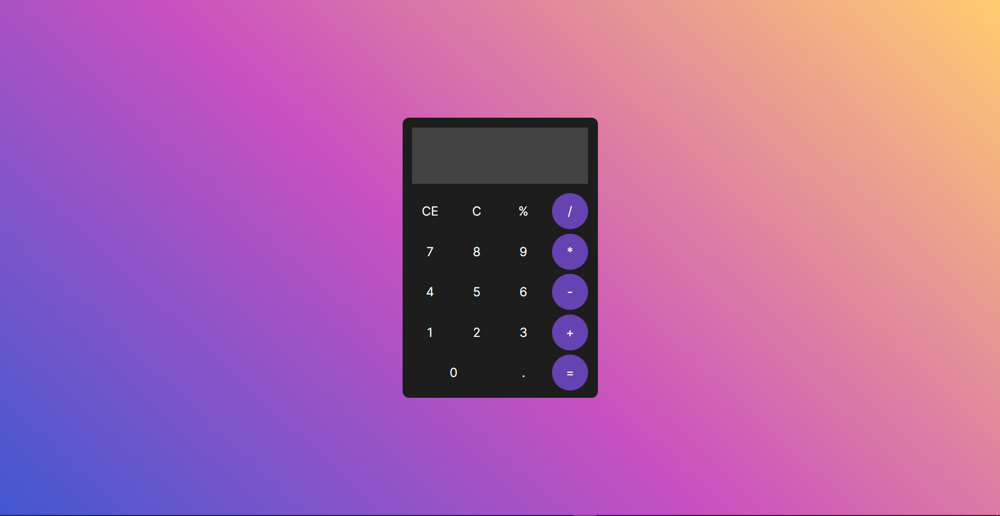

# **Calculadora**

## :symbols: **Projeto**
Este projeto faz parte o desafio ***21 Dias de Código*** e se baseia em uma calculadora.

## :link: **Link**
*[Link do projeto.](https://davsilvam.github.io/21diasdecodigo/04/)*

## :art: **Visual do Projeto**
### *Desktop e Telas Maiores*

<h1 align="center">
    
</h1>

## :rocket: **Funcionalidades do Projeto**
O projeto conta atualmente com:
* Função de soma (+).
* Função de subtração (-).
* Função de multiplicação (*).
* Função de divisão (/).
* Função de resto da divisão (%).
* Função para limpar toda a operação (CE).
* Função para limpar o último termo da operação (C).
* Função de resultado (=).
* Capacidade para identificar números com casas decimais (.).

## :wrench: **Tecnologias**
Tecnologias utilizadas no projeto.
* HTML;
* CSS;
* JavaScript;
* Visual Studio Code.

## :ballon: **Inspiração**
*[Link para o vídeo de inspiração.](https://www.youtube.com/watch?v=42TShjXR0m0&t=392s)*