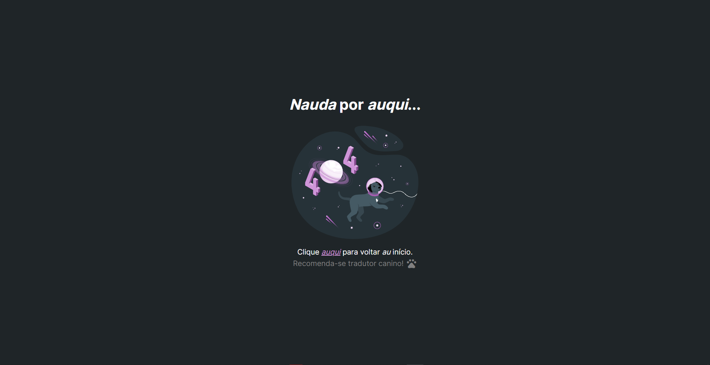

# **Erro 404**

## :paw_prints: **Projeto**
Este projeto faz parte do desafio ***21 Dias de Código*** e se baseia em uma pequena página que apresenta o Erro 404 com uma temática canina.
## :link: **Link**
*[Link do projeto.](https://davsilvam.github.io/21diasdecodigo/05/)*

## :art: **Visual do Projeto**
### *Desktop e Telas Maiores*

<h1 align="center">
    
</h1>

## :rocket: **Funcionalidades do Projeto**
O projeto conta atualmente com:
* Mostrar uma página de Erro 404.

## :wrench: **Tecnologias**
Tecnologias utilizadas no projeto.
* HTML;
* CSS;
* Visual Studio Code;
* Google Fonts e Material Symbols;
* Imagem de *[storyset](https://storyset.com/illustration/404-error-lost-in-space/amico)*.

## :computer: **Autor**
Feito com :purple_heart: por [David Silva](https://www.linkedin.com/in/davsilvam/).
