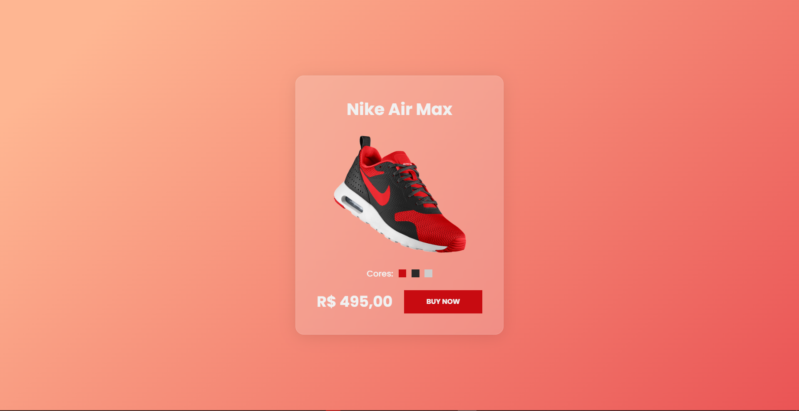

# **Glassmorphism**

## :shoe: **Projeto**

Este projeto faz parte do desafio **_21 Dias de Código_** e se baseia em uma pequena página com um card de um tênis da Nike com o efeito de _Glassmorphism_ em seu fundo.

## :link: **Link**

_[Link do projeto.](https://davsilvam.github.io/21-dias-de-codigo/06/)_

## :art: **Visual do Projeto**

### _Desktop e Telas Maiores_

<h1 align="center">
    
</h1>

## :rocket: **Funcionalidades do Projeto**

O projeto conta atualmente com:

- Mostrar uma página com o card.

## :wrench: **Tecnologias**

Tecnologias utilizadas no projeto.

- HTML;
- CSS;
- Visual Studio Code;
- Google Fonts;
- Glassmorphism de _[css.glass](https://css.glass)_.

## :computer: **Autor**

Feito com :purple_heart: por [David Silva](https://www.linkedin.com/in/davsilvam/).
