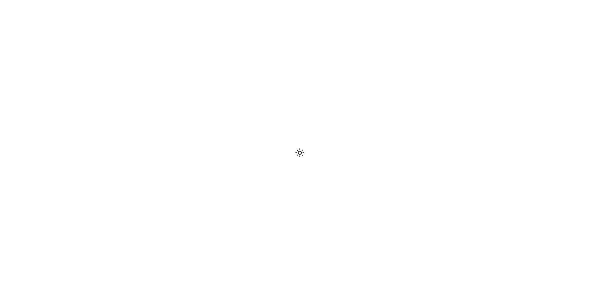

# **Toogle Tema**

## :first_quarter_moon: **Projeto**
Este projeto faz parte o desafio ***21 Dias de Código*** e se baseia em uma pequena página com ícone que ao ser clicado, altera o tema da página.

## :link: **Link**
*[Link do projeto.](https://davsilvam.github.io/21diasdecodigo/08/)*

## :art: **Visual do Projeto**
### *Desktop e Telas Maiores*

<h1 align="center">
    
</h1>

## :rocket: **Funcionalidades do Projeto**
O projeto conta atualmente com:
* Alteração do tema entre claro e escuro.
* Alteração do ícone central dinamicamente.

## :wrench: **Tecnologias**
Tecnologias utilizadas no projeto.
* HTML;
* CSS;
* Visual Studio Code;
* Google Material Icons.

## :computer: **Autor**
Feito com :purple_heart: por [David Silva](https://www.linkedin.com/in/davsilvam/).
