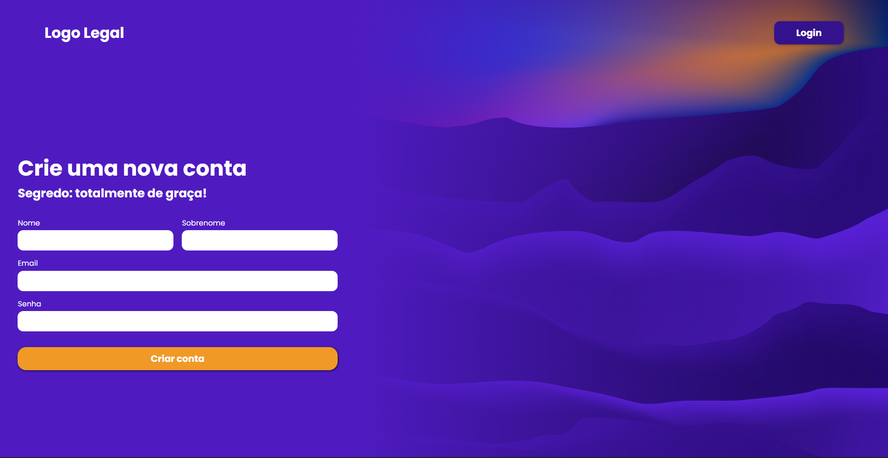

# **Formulário de Login**

## :clipboard: **Projeto**
Este projeto faz parte do desafio ***21 Dias de Código*** e se baseia em uma pequena página com um formulário de Login.

## :link: **Link**
*[Link do projeto.](https://davsilvam.github.io/21diasdecodigo/11/)*

## :art: **Visual do Projeto**
### *Desktop e Telas Maiores*

<h1 align="center">
    
</h1>

## :rocket: **Funcionalidades do Projeto**
O projeto conta atualmente com:
* Pequena área com um formulário.

## :wrench: **Tecnologias**
Tecnologias utilizadas no projeto.
* HTML;
* CSS;
* Google Fonts;
* Visual Studio Code;
* Imagem de *[Unsplash](https://unsplash.com)*.

## :computer: **Autor**
Feito com :purple_heart: por [David Silva](https://www.linkedin.com/in/davsilvam/).
