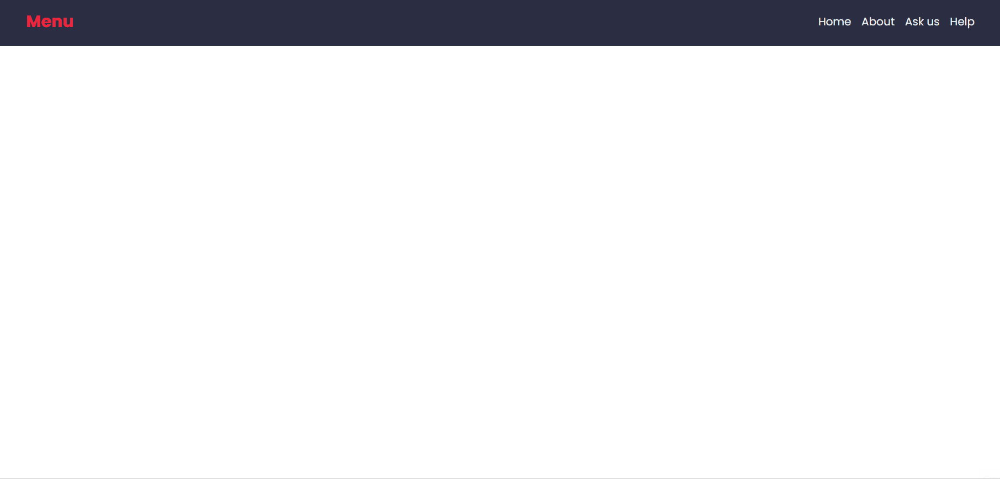
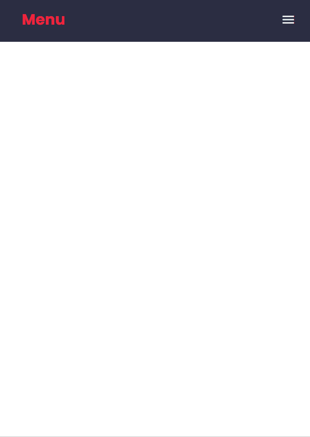

# **Menu Responsivo**

## :hamburger: **Projeto**
Este projeto faz parte do desafio ***21 Dias de Código*** e se baseia em uma pequena página com um menu responsivo que se adapta ao tamanho da tela do usuário.

## :link: **Link**
*[Link do projeto.](https://davsilvam.github.io/21diasdecodigo/13/)*

## :art: **Visual do Projeto**
### *Desktop e Telas Maiores*

<h1 align="center">
    
</h1>

### *Mobile e Telas Menores*

<h1 align="center">
    
</h1>

## :rocket: **Funcionalidades do Projeto**
O projeto conta atualmente com:
* Barra de navegação dinâmica;
* Menu hamburger com disposição lateral para telas menores;
* Responsividade.

## :wrench: **Tecnologias**
Tecnologias utilizadas no projeto.
* HTML;
* CSS;
* JavaScript;
* Google Fonts e Material Icons;
* Visual Studio Code.

## :computer: **Autor**
Feito com :purple_heart: por [David Silva](https://www.linkedin.com/in/davsilvam/).
