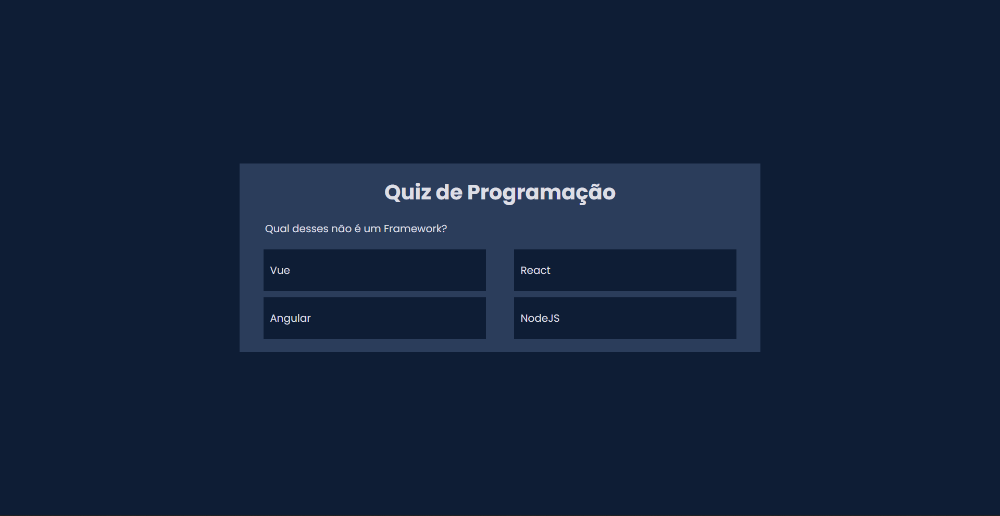
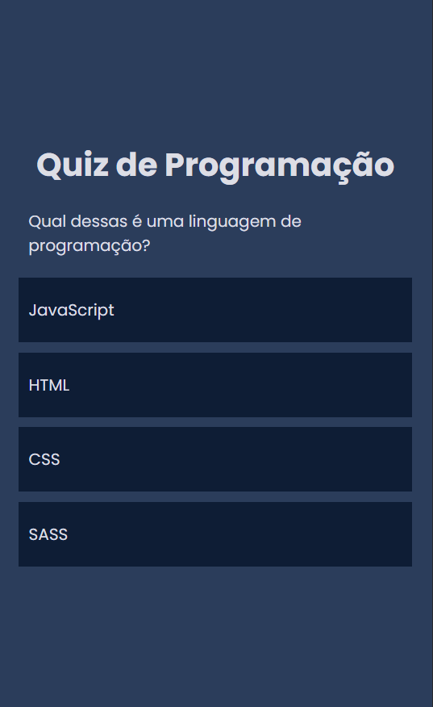

# **Quiz**

## :white_check_mark: **Projeto**

Este projeto faz parte do desafio **_21 Dias de Código_** e se baseia em um quiz com o tema _programação_.

## :link: **Link**

_[Link do projeto.](https://davsilvam.github.io/21-dias-de-codigo/14/)_

## :art: **Visual do Projeto**

### _Desktop e Telas Maiores_

<h1 align="center">
    
</h1>

### _Mobile e Telas Menores_

<h1 align="center">
    
</h1>

## :rocket: **Funcionalidades do Projeto**

O projeto conta atualmente com:

- Perguntas que mudam dinamicamente;
- Destaque nas respostas corretas e erradas;
- Responsividade.

## :wrench: **Tecnologias**

Tecnologias utilizadas no projeto.

- HTML;
- CSS;
- JavaScript;
- Google Fonts;
- Visual Studio Code.

## :computer: **Autor**

Feito com :purple_heart: por [David Silva](https://www.linkedin.com/in/davsilvam/).
