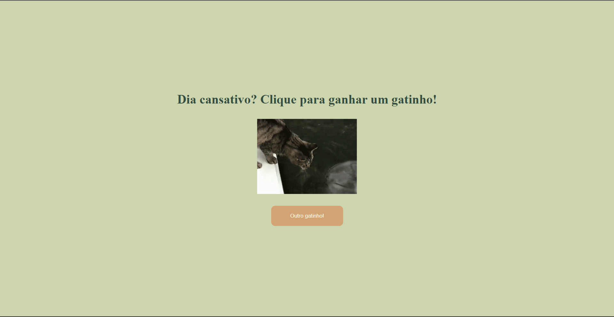

# **Site com API Pública**

## :smirk_cat: **Projeto**

Este projeto faz parte do desafio **_21 Dias de Código_** e se baseia em uma pequena página que gera gifs aleatórios de gatos consumindo a _[TheCatAPI](https://docs.thecatapi.com)_.

## :link: **Link**

_[Link do projeto.](https://davsilvam.github.io/21-dias-de-codigo/16/)_

## :art: **Visual do Projeto**

### _Desktop e Telas Maiores_

<h1 align="center">
    
</h1>

## :rocket: **Funcionalidades do Projeto**

O projeto conta atualmente com:

- Gifs alterados dinamicamente;
- Botão para carregar outro gif de gatinho.

## :wrench: **Tecnologias**

Tecnologias utilizadas no projeto.

- HTML;
- CSS;
- JavaScript;
- Google Fonts;
- [TheCatAPI](https://docs.thecatapi.com);
- Visual Studio Code.

## :computer: **Autor**

Feito com :purple_heart: por [David Silva](https://www.linkedin.com/in/davsilvam/).
