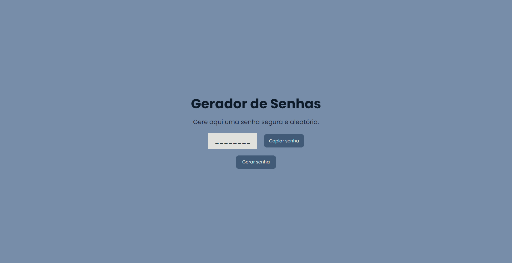

# **Gerador de Senhas**

## :closed_lock_with_key: **Projeto**
Este projeto faz parte do desafio ***21 Dias de Código*** e se baseia em uma página que gera senhas aleatórias para o usuário.

## :link: **Link**
*[Link do projeto.](https://davsilvam.github.io/21diasdecodigo/18/)*

## :art: **Visual do Projeto**
### *Desktop e Telas Maiores*

<h1 align="center">
    
</h1>

## :rocket: **Funcionalidades do Projeto**
O projeto conta atualmente com:
* Geração de senhas aleatórias com números e letras;
* Botão de copiar a senha para área de transferência.

## :wrench: **Tecnologias**
Tecnologias utilizadas no projeto.
* HTML;
* CSS;
* JavaScript;
* Google Fonts;
* Visual Studio Code.

## :computer: **Autor**
Feito com :purple_heart: por [David Silva](https://www.linkedin.com/in/davsilvam/).