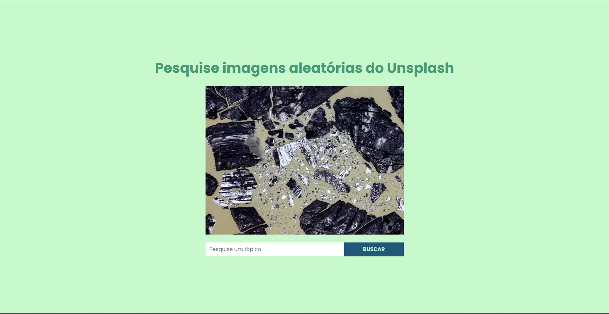
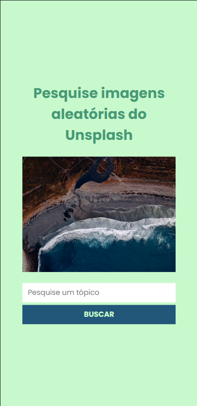

# **Fotos Aleatórias do Unsplash**

## :mount_fuji: **Projeto**
Este projeto faz parte do desafio ***21 Dias de Código*** e se baseia em uma página que gera imagens aleatórias diretamente da *[Unsplash Image API](https://unsplash.com/developers).*

## :link: **Link**
*[Link do projeto.](https://davsilvam.github.io/21diasdecodigo/19/)*

## :art: **Visual do Projeto**
### *Desktop e Telas Maiores*

<h1 align="center">
    
</h1>

### *Mobile e Telas Menores*

<h1 align="center">
    
</h1>

## :rocket: **Funcionalidades do Projeto**
O projeto conta atualmente com:
* Gera imagens aleatórias com base na API;
* Possui um campo para pesquisa de imagens de um determinado tópico.

## :wrench: **Tecnologias**
Tecnologias utilizadas no projeto.
* HTML;
* CSS;
* JavaScript;
* Google Fonts;
* *[Unsplash Image API](https://unsplash.com/developers);
* Visual Studio Code.

## :computer: **Autor**
Feito com :purple_heart: por [David Silva](https://www.linkedin.com/in/davsilvam/).